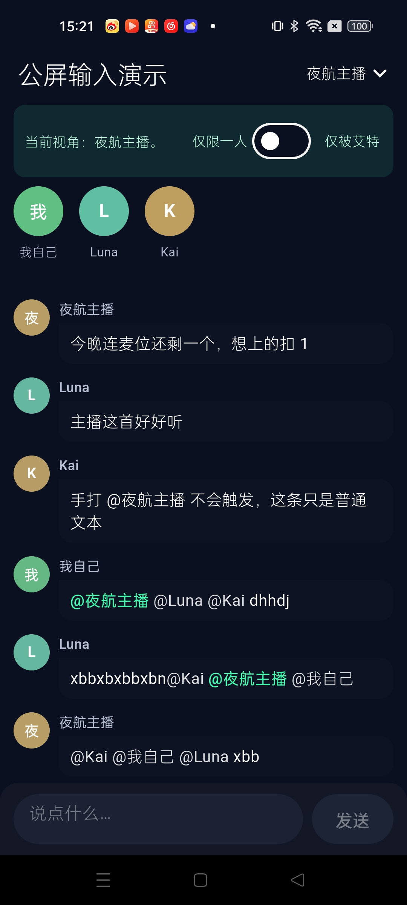
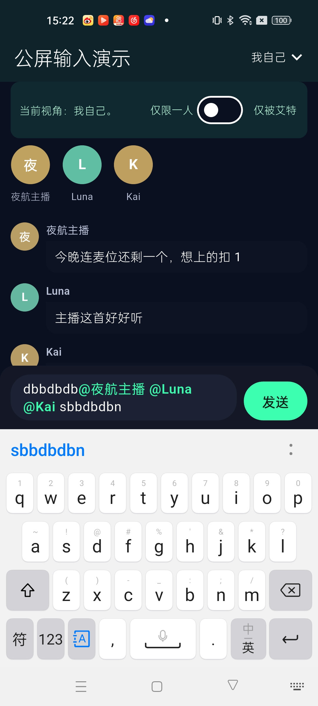

# 公屏输入框

Flutter 直播间公屏输入示例。艾特（@ mention）做成输入框里的原子 token，可以出现在正文中间，也能一次艾特多人。发出去的正文就是观众看到的那一句；只有从入口确认的人才会写入 `atUsers`，手打的 `@昵称` 只留在正文里。回复单独固化成快照，原消息删除后引用还在。

## 环境

最低编译版本：**Flutter 3.41.9**（Dart 3.11.5）。

`pubspec.yaml` 中的约束是 `sdk: ^3.11.5`。

## 效果

当前视角是「夜航主播」，高亮范围是「仅被艾特」。公屏里只有 `@夜航主播` 是绿色，其他人的艾特保持普通正文。



当前视角是「我自己」。输入框里可以先打字，再连续艾特多人，艾特前后都能继续输入。图中「仅限一人」关闭。



## 数据结构

输入框里维护的就是全文案。`你好@Luna @Kai 在吗` 发出去、公屏拿回来，都是这一句，不再把原子 `@` 剥掉再按插入下标拼回去。

发送参数和公屏消息用同一组字段：

| 字段 | 含义 |
| --- | --- |
| `content` | 观众看到的整句，包含 `@昵称 `。发送前只做 `trim`。 |
| `atUsers` | 入口确认过的用户，每项是 `userId` + `nickname`。顺序与正文里出现的顺序一致。 |
| `reply` | 可选。回复快照：`msgId`、`senderId`、`senderName`、`content`。 |

`toSendChatMsg` 的形状：

```json
{
  "roomId": 88,
  "content": "你好@Luna @Kai 在吗",
  "atUsers": [
    { "userId": "u_luna", "nickname": "Luna" },
    { "userId": "u_kai", "nickname": "Kai" }
  ],
  "reply": {
    "msgId": "msg_1",
    "senderId": "u_anchor",
    "senderName": "夜航主播",
    "content": "今晚连麦位还剩一个"
  }
}
```

`MentionTarget.token` 是输入框里的原子块，文本为 `@昵称 `，尾部空格用来和后面的正文分开。手打的 `@xxx` 留在 `content` 里，不会进 `atUsers`。

公屏上的 `PublicChatMessage` 直接存这份 `content`、`atUsers` 和 `reply`，另外只补消息 id、发送者和时间。引用区读的是发送时固化的 `reply`，原消息被删掉也不改这份快照。

草稿分两层：

- `MentionEditingController` 管输入框全文，以及每个已确认 token 的起点。
- `ChatComposerController` 管回复、焦点、能否发送和高亮策略，并在发送时把全文和 `atUsers` 组装成 `ChatSendPayload`。

## UI 渲染

输入框和公屏都在同一段全文上上色，不另外维护一份「去掉 @ 的正文」。

**输入框。** `MentionEditingController` 按已记录的 token 区间把全文切成 `TextSpan`。原子 `@昵称 ` 使用 `mentionHighlightStyle`；`highlight == off` 时和正文同一套样式。手打的 `@xxx` 没有区间，保持普通文字。

**公屏。** `PublicChatBubble` 按 `atUsers` 的顺序，从 `content` 里找下一次 `@昵称 `：

- 先匹配带尾部空格的完整 token。
- 艾特落在句尾时，`trim` 会吃掉这个空格，只剩 `@昵称`。这时只在字符串末尾接受不带空格的写法，避免把句子中间的普通文字认成艾特。
- 找不到的用户跳过。光标之后剩下的文字，包括手打的 `@xxx`，都是普通 `TextSpan`。

高亮只影响展示，不写进发送参数：

- `mentioned`：只有 `userId == 当前视角` 的那一段用高亮色，其他人的艾特用普通正文色。
- `everyone`：所有入口确认的艾特都高亮。
- `off`：和正文同一套样式。

## 设计原理

艾特不是「句首前缀」，也不是盖在输入框上的标签。`MentionEditingController` 继承 `TextEditingController`，在同一段文本里记下每个已确认 token 的起点。所以可以先打字，再艾特，再继续打字，例如 `前文 @Luna @Kai 后文`。

一条消息里有两种 `@`：

- **入口确认的艾特。** 长按头像、长按昵称，或资料卡点 `@`，才会生成 `MentionTarget`，并进入 `atUsers`。
- **手打的 `@xxx`。** 只是普通字符。不进 mention 列表，发送时也不会出现在 `atUsers` 里。

token 按原子块编辑：

- 光标可以停在 token 前面或后面。落在内部时，贴到最近的边缘，避免改掉半个昵称。
- 输入法的 composing 区间如果压进 token，先结束合成，避免和键盘抢文本。
- 改动落在 token 外面时，只平移后面那些艾特的起点。
- 改动一旦碰到某个 token，整段删掉，前后正文保留。多人艾特时，没碰到的那些仍然留着。

人数用 `maxMentions` 控制。`null` 不限制；设为 `1` 时后一次艾特在原位置替换前一次。同一个人不会插入第二次。

回复和艾特分开。Reply 每次只保留一条 `ReplySnapshot`。进入回复会清空草稿；进入艾特不会。资料卡和消息菜单上的浮层由页面自己关掉，不放进输入控制器。

## 核心功能

- **入口艾特。** 长按头像、长按昵称，或在资料卡点 `@`。token 插在当前光标处，已输入的文字保留。
- **多人艾特。** 默认可连续艾特多人，同一个人不会重复插入。`maxMentions` 设为 `1` 时只保留一人，后一次替换前一次。
- **原子 token。** `@昵称 ` 整段是一块。光标可以停在前面或后面，点进内部会贴到最近的边缘；删到这块本身会整段去掉，两边的文字留下。
- **高亮范围。** `highlight` 可选 `mentioned`（仅被艾特者）、`everyone`（所有人）、`off`（关闭）。颜色和字重用 `mentionHighlightStyle`。
- **回复一条。** 长按消息选 Reply，每次只挂一条。发送时把引用快照一并带上；原消息删除后，已经发出的引用仍用这份快照。
- **发送参数。** `content` 是 trim 后的全文，原子 `@昵称 ` 留在句子里。`atUsers` 只包含入口确认过的人。公屏拿到的就是这一份。

演示页顶部可以切换当前视角、「仅限一人」和艾特高亮。

## 注意事项

- 手打 `@xxx` 不会进入 `atUsers`，也不会变成可高亮的原子 token。
- 全文 trim 后为空不能发送。只有一个原子 `@` 也可以发送。
- 从入口艾特不会清空已输入的正文。进入回复会清空当前草稿。
- 输入框在高亮未关闭时，正在编辑的 token 会着色，方便辨认原子块。公屏是否变色由 `highlight` 和当前视角决定。
- 不能艾特自己。演示里点自己的资料卡时，`@` 按钮不可用。

## 运行

需要 Flutter 3.41.9 / Dart 3.11.5 及以上。

```bash
flutter pub get
flutter run
```
